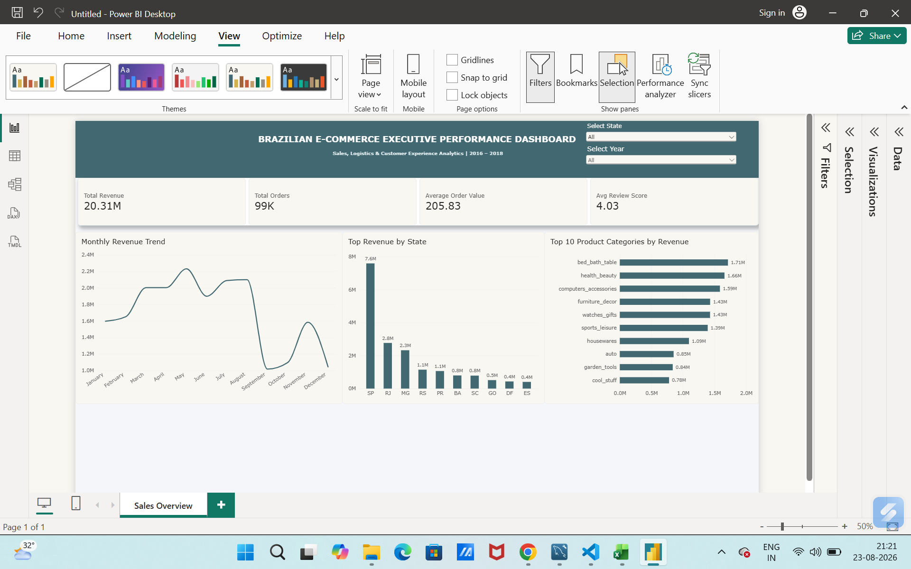
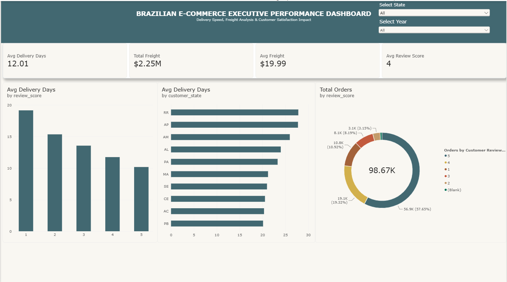

# 📊 Brazilian E-Commerce Executive Performance & Logistics Dashboard

A comprehensive end-to-end Data Analytics project built with **Power BI**, analyzing over **100,000+ orders** from the Brazilian E-Commerce (Olist) public dataset. This project delivers actionable insights into sales performance, customer satisfaction, freight optimization, and regional logistics bottlenecks.

---

## 📌 Project Overview

This dashboard serves as an executive decision-making tool for C-suite and operations leaders to monitor:
- **Revenue & Growth Trends:** High-performing product categories, seasonality, and revenue concentration by state.
- **Logistics & Delivery Efficiency:** The direct impact of delivery delays on customer satisfaction and review scores.
- **Geographical Disparities:** Freight costs and transit times across Brazilian federal states.

---

## 🖥️ Dashboard Architecture & Visuals

### 1. Sales & Revenue Overview (Page 1)
- **Executive KPIs:** Total Revenue ($20.31M), Total Orders (99K), Average Order Value ($205.83), Average Review Score (4.03 / 5.00).
- **Monthly Revenue Trend:** Interactive line chart mapping monthly sales fluctuations and peak seasons (Q2–Q3 growth).
- **Top Revenue by State:** Column chart highlighting São Paulo (`SP`) and Rio de Janeiro (`RJ`) as core revenue drivers.
- **Top 10 Product Categories:** Horizontal bar chart displaying leading categories (e.g., *Bed Bath Table*, *Health & Beauty*, *Computers & Accessories*).

### 2. Operations & Logistics Performance (Page 2)
- **Logistics KPIs:** Average Delivery Days (12.01 Days), Total Freight ($2.25M), Average Freight per Order ($19.99).
- **Customer Satisfaction Impact:** Column chart proving the inverse correlation between delivery duration and review ratings (1-star orders take ~20 days vs. ~10 days for 5-star orders).
- **Regional Bottlenecks:** Bar chart analyzing high-transit states in northern Brazil (e.g., `RR`, `AP`, `AM` averaging >25 days).
- **Review Score Distribution:** Donut visual breaking down customer ratings share across 1 to 5 stars.

---

## 🛠️ Tech Stack & Data Workflow

- **Data Sourcing:** Olist Brazilian E-Commerce Dataset (Kaggle)
- **Data Transformation & Modeling:** Power Query (ETL, schema joining, missing value treatment, custom date calculations)
- **DAX Measures:** Calculated metrics for dynamic KPI aggregation and dimensional filtering
- **Data Visualization & UI/UX Design:** Power BI Desktop (Color palette: `#426871` Slate Teal, synced slicers, visual hierarchy)

---

## 📐 Key DAX Measures Used

```dax
// 1. Total Revenue
Total Revenue = SUM(ecommerce_analysis_ready[price])

// 2. Total Orders
Total Orders = DISTINCTCOUNT(ecommerce_analysis_ready[order_id])

// 3. Average Order Value (AOV)
Average Order Value = DIVIDE([Total Revenue], [Total Orders], 0)

// 4. Average Review Score
Avg Review Score = AVERAGE(ecommerce_analysis_ready[review_score])

// 5. Average Delivery Duration (Days)
Avg Delivery Days = AVERAGE(ecommerce_analysis_ready[delivery_days])

// 6. Total Freight Cost
Total Freight = SUM(ecommerce_analysis_ready[freight_value])

// 7. Average Freight per Order
Avg Freight = AVERAGE(ecommerce_analysis_ready[freight_value])
```

---

## 💡 Key Strategic Insights & Recommendations

1. **Delivery Speed Directly Drives Customer Retention:**
   - Orders delivered within **10 days** consistently received **5-star ratings**, whereas orders delayed beyond **19–20 days** had a 70%+ drop into **1-star reviews**.
   - *Recommendation:* Establish regional micro-fulfillment centers in northern states (`RR`, `AM`, `AP`) to reduce delivery transit times from 25+ days down to under 12 days.

2. **Geographical Revenue Concentration:**
   - Over **35% of total sales** originate from São Paulo (`SP`).
   - *Recommendation:* Prioritize local supply chain partnerships and targeted promotional campaigns within southeastern urban clusters.

3. **Freight Cost Optimization:**
   - Freight accounts for over **11% of total transaction value** ($2.25M on $20.31M revenue).
   - *Recommendation:* Bundle low-weight/high-margin items (e.g., *Health & Beauty*, *Watches*) into free-shipping tiers to boost average order value.

---

🚀 How to Run the Project

1.  Clone this repository:

git clone https://github.com/priyadarshan996/brazilian-ecommerce-analytics.git

2. Open brazilian_ecommerce_dashboard.pbix in Power BI Desktop.
3. Explore the interactive slicers (Select State, Select Year) across both tabs.
---
📸 Dashboard Preview
Sales & Revenue Overview



Operations & Logistics Performance



## 👤 Author
- **Priyadarshan Sharma**  
- **Role:** Data Analyst  
- **Tools:** SQL | Python | Power BI | Excel
